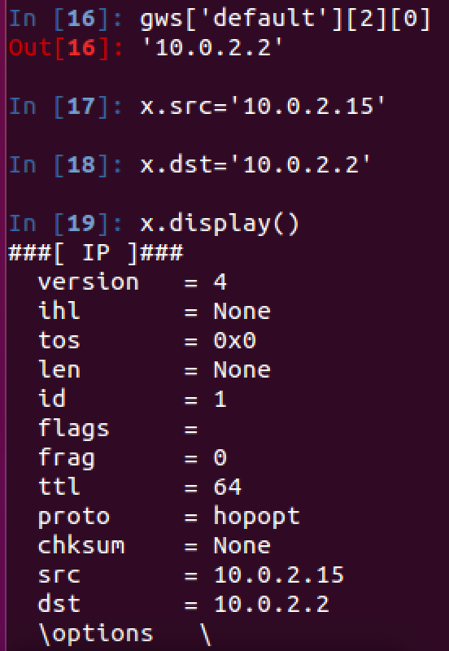

##FCM-742 - Network Security - Lab 4
####I started with a fresh 15.10 Ubuntu VM in VirtualBox.  I had no trouble with installations except I needed to install libpcap0.8 or libpcap-dev.  I prefer, as you do, to import modules right into a python shell - in my case, iPython. 
---
I had no trouble with seeing the default values for scapy:

---
I used ifaddresses in netifaces to extract my local IP and the gateway:

---
I encapsulated an ICMP packet inside of an IP packet:

---
We made a custom payload: 

---
And we successfully sent the packet and received a response:

---
One of the cooler things I discovered is <code>%save</code> and <code>%load</code> to save and load .py files for use in iPython. 
Of course, it's exporting all the commands from the notebook--even the mistakes--so it's necessary to scrub some of the commands with nano or gedit.
 

I can certainly see how these are the fundamentals to crafting packets.  Of course since it's in python, the next steps could be conditionals, monitors, and ways to automate network tasks--even the start to penetration testing.
